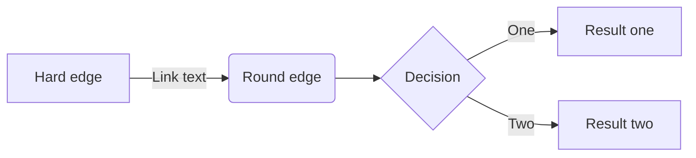
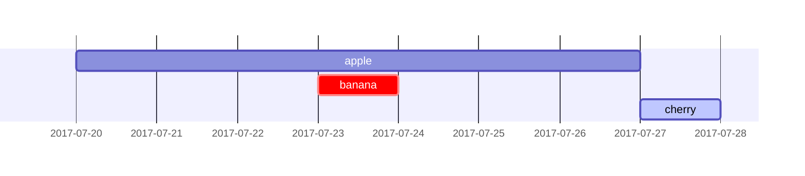
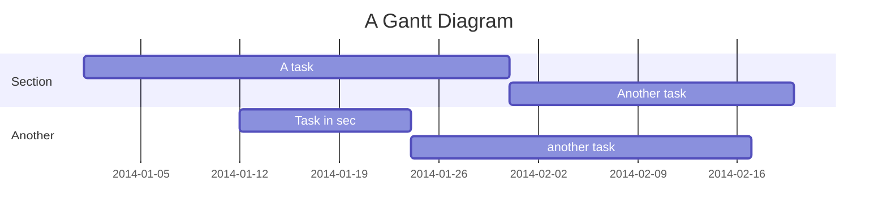
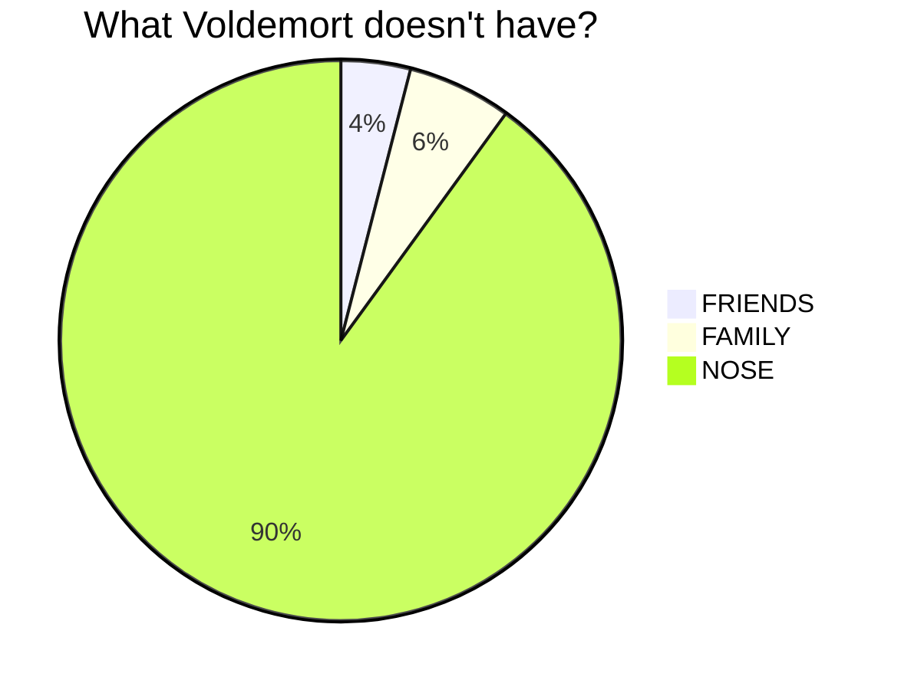
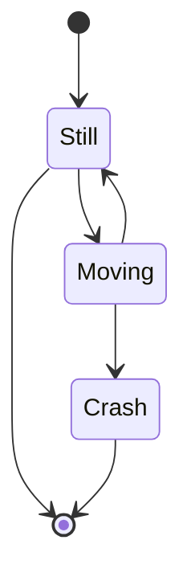
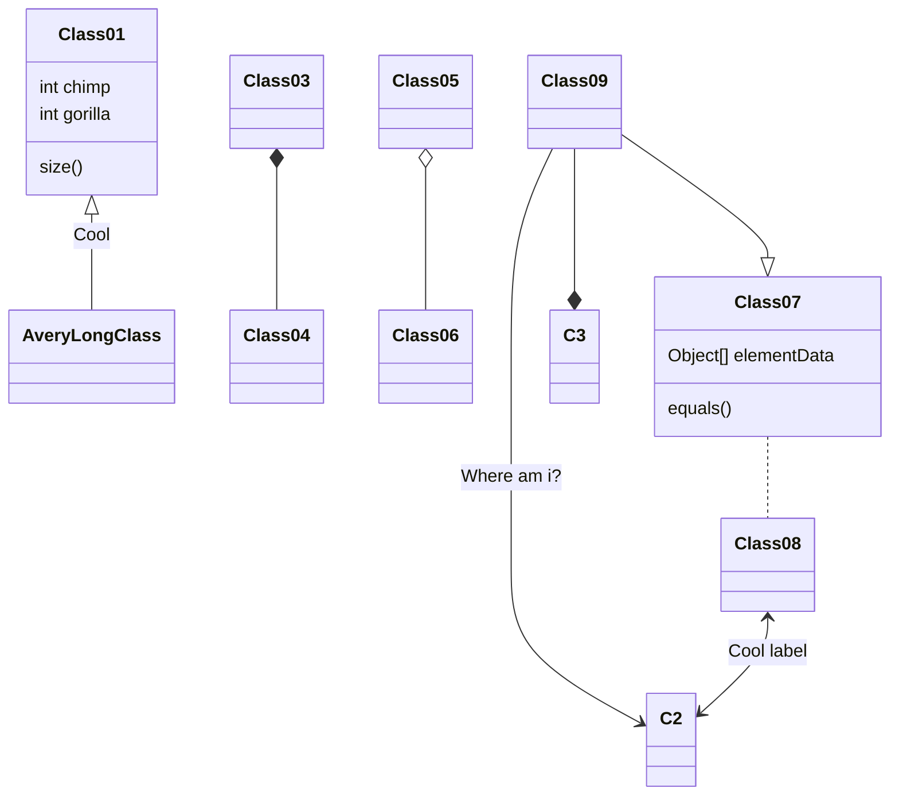
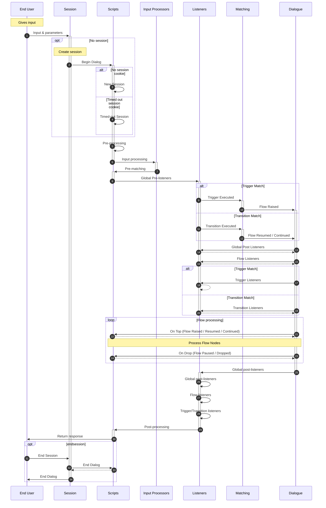
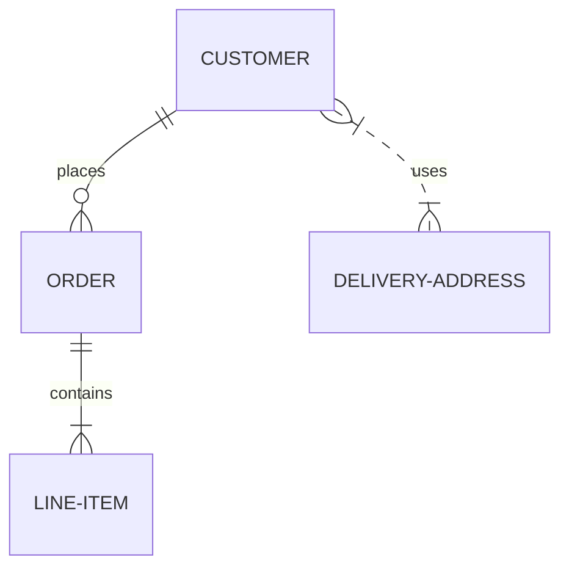

# Mermaid

## Flow Chart

```mermaid
graph LR
    A[Hard edge] -->|Link text| B(Round edge)
    B --> C{Decision}
    C -->|One| D[Result one]
    C -->|Two| E[Result two]
```

## Gantt

```mermaid
    gantt
        apple :a, 2017-07-20, 1w
        banana :crit, b, 2017-07-23, 1d
        cherry :active, c, after b a, 1d
```

```mermaid
gantt
    title A Gantt Diagram
    dateFormat  YYYY-MM-DD
    section Section
    A task           :a1, 2014-01-01, 30d
    Another task     :after a1  , 20d
    section Another
    Task in sec      :2014-01-12  , 12d
    another task      : 24d
```

## Pie Charts

```mermaid
pie title What Voldemort doesn't have?
         "FRIENDS" : 2
         "FAMILY" : 3
         "NOSE" : 45
```

## State Diagram

```mermaid
stateDiagram
  [*] --> Still
  Still --> [*]

  Still --> Moving
  Moving --> Still
  Moving --> Crash
  Crash --> [*]
```

## Git Graph

```mermaid
gitGraph:
options
{
    "nodeSpacing": 150,
    "nodeRadius": 10
}
end
commit
branch newbranch
checkout newbranch
commit
commit
checkout master
commit
commit
merge newbranch
```

## Class Diagram

```mermaid
classDiagram
Class01 <|-- AveryLongClass : Cool
Class03 *-- Class04
Class05 o-- Class06
Class07 .. Class08
Class09 --> C2 : Where am i?
Class09 --* C3
Class09 --|> Class07
Class07 : equals()
Class07 : Object[] elementData
Class01 : size()
Class01 : int chimp
Class01 : int gorilla
Class08 <--> C2: Cool label
```

## Sequence Diagram

```mermaid
sequenceDiagram
  %% Try it here: https://mermaid-js.github.io/mermaid-live-editor
  autonumber
  participant enduser as End User
  participant session as Session
  participant scripts as Scripts
  participant inputprocessors as Input Processors
  participant listeners as Listeners
  participant matching as Matching
  participant dialogue as Dialogue

  Note over enduser: Gives input
  enduser->>+session: Input & parameters

  opt No session
    Note over session: Create session
    session->>+scripts: Begin Dialog    

    alt No session cookie
      scripts->>scripts: New Session    
    else Timed out session cookie
      scripts->>scripts: Timed-out Session    
    end
  end

  scripts->>scripts: Pre-processing
  scripts->>+inputprocessors: Input processing
  deactivate scripts

  inputprocessors->>+scripts: Pre-matching
  deactivate inputprocessors
  scripts->>+listeners: Global Pre-listeners
  deactivate scripts

  alt Trigger Match
    listeners->>+matching: Trigger Executed
    matching->>+dialogue: Flow Raised
    deactivate matching
  else Transition Match  
    listeners->>+matching: Transition Executed
    matching->>dialogue: Flow Resumed / Continued
    deactivate matching
  end 

  dialogue->>listeners: Global Post Listeners
  listeners-->>dialogue: 
  dialogue->>listeners: Flow Listeners
  listeners-->>dialogue: 
  
  alt Trigger Match
    dialogue->>listeners: Trigger Listeners
    listeners-->>listeners: 
  else Transition Match  
    dialogue->>listeners: Transition Listeners
    listeners-->>dialogue: 
    deactivate listeners
  end
  
  loop Flow processing
    dialogue->>+scripts: On Top (Flow Raised / Resumed / Continued)
    scripts-->>-dialogue: 

    Note over scripts,dialogue: Process Flow Nodes

    dialogue->>+scripts: On Drop (Flow Paused / Dropped)
    scripts-->>-dialogue: 
  end

  dialogue->>+listeners: Global post-listeners
  deactivate dialogue

  listeners->>listeners: Global post-listeners
  listeners->>listeners: Flow listeners
  listeners->>listeners: Trigger/Transition listeners

  listeners->>+scripts: Post-processing
  deactivate listeners
  scripts->>-enduser: Return response 

  opt endsession
    enduser->>session : End Session
    session->>+scripts: End Dialog    
    scripts-->>-session: 
    session->>-enduser: End Dialog
  end
```

## Entity Relationship

```mermaid
erDiagram
    CUSTOMER ||--o{ ORDER : places
    ORDER ||--|{ LINE-ITEM : contains
    CUSTOMER }|..|{ DELIVERY-ADDRESS : uses
```
